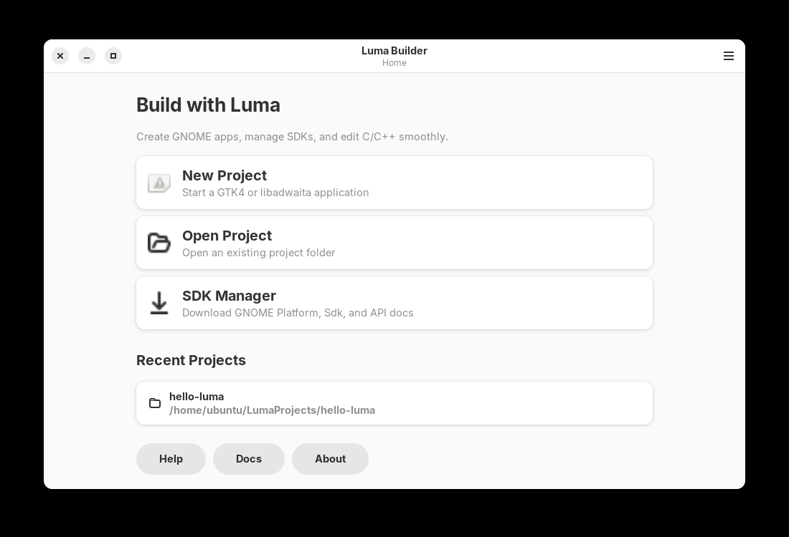
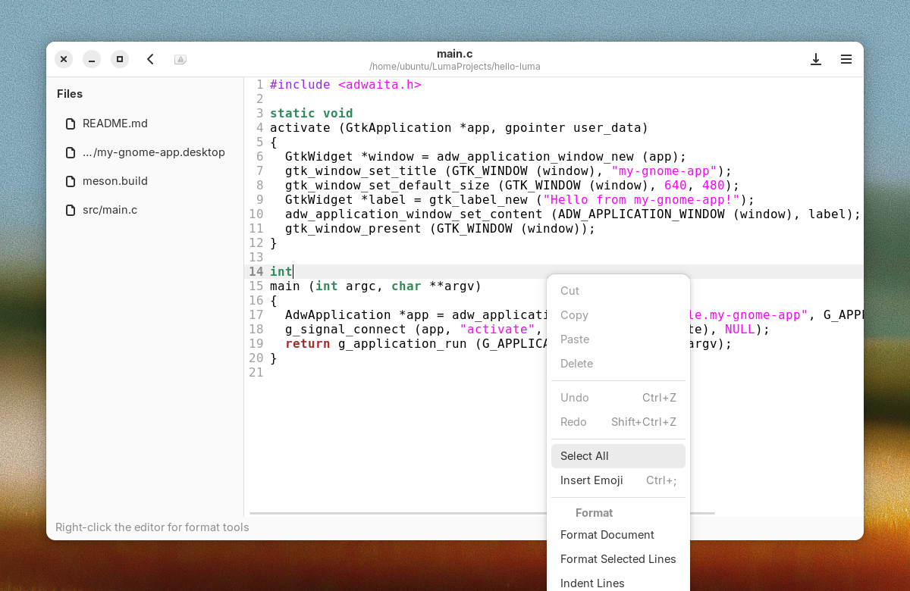
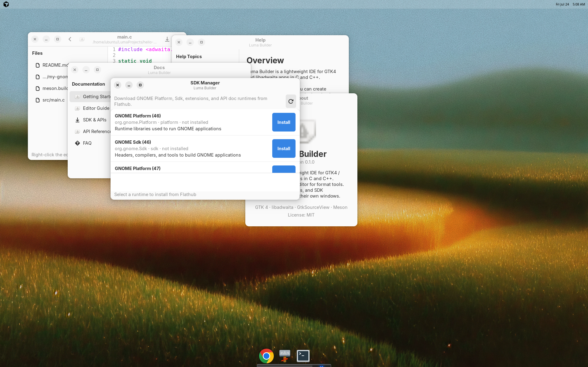

# Luma Builder

Lightweight GTK4 / libadwaita IDE for creating GNOME applications in **C** and **C++**.

## Features

- Homescreen with **New Project**, **Recent Projects**, and menu access to Help / Docs / SDK / About
- **SDK Manager** window to download GNOME Platform / Sdk Flatpak runtimes
- Editor with a **file tree** and **right-click tools** (Format, Indent, Trim, Sort Lines, Comment)
- Help, Docs, SDK, and About each open in **their own window**

## Dependencies

On Ubuntu 24.04:

```bash
sudo apt install meson ninja-build build-essential pkg-config \
  libgtk-4-dev libadwaita-1-dev libgtksourceview-5-dev \
  libjson-glib-dev libsoup-3.0-dev gettext desktop-file-utils flatpak
```

## Build & run

```bash
CC=gcc CXX=g++ meson setup build
meson compile -C build
GSETTINGS_SCHEMA_DIR=build/data ./build/src/luma-builder
```

## Tips

- **Right-click** in the editor for format tools (also available from the header ☰ menu).
- Projects default to `~/LumaProjects`.
- Press `F1` for Help, `Ctrl+S` to save, `Ctrl+Shift+F` to format the document.

## Screenshots

See [docs/screenshots/](docs/screenshots/) for images of every window and the editor menus.





## License

MIT — see [LICENSE](LICENSE).
